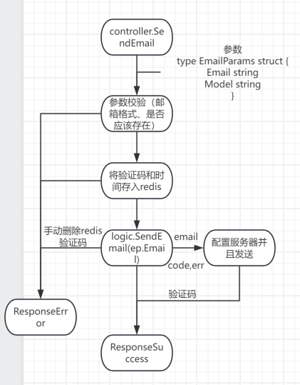

 # comyun简介

comyun实现公司内部管理，公司流程表单、人员、订单信息等自定制管理

## 功能特性

- 特性1：登录与注册
   1. 路由
      ```go
      //注册用户
    	//发送验证码
    	v1.POST("/send_email",controller.SendEmail)
    	//注册并填写信息
    	v1.POST("/signup",controller.Signup)
    	v1.POST("/judge_code",controller.JudgeCode)
    	//登录并返回token
    	v1.POST("/login_code",controller.LoginCode)
    	v1.POST("/login_pass",controller.LoginPass)
      ```
  2. 设计思路
     1. 指定邮箱发送验证码
        ```go
        //发送验证码
	      v1.POST("/send_email",controller.SendEmail)
        ```
        
     	改进：redis中类似nysql的回滚操作，方便在存入验证码成功但发送邮件失败时避免redis无效存储（目前在出错时手动删除键值对redis.DeleteEmail(ep.Email)）
     3. 注册填写基本信息
        ```go
        //注册-填写信息
	      v1.POST("/signup",controller.Signup)
        ```
     4. 注册验证验证码
        ```go
        //注册-验证验证码
	      v1.POST("/judge_code",controller.JudgeCode)
        ```
     5. 两种登录方式
       ```go
        //登录并返回token
      	//邮箱登录
      	v1.POST("/login_code",controller.LoginCode)
      	//密码登录
      	v1.POST("/login_pass",controller.LoginPass)
        ```
  3. 
- 特性2：公司人员管理
- 特性3：表单设计与查询

## 安装指南

1. **克隆仓库**：

    ```bash
    git clone https://github.com/username/repository.git
    ```


## 使用方法

1. **启动应用**：

    - 对于 Python 项目：

        ```bash
        python app.py
        ```

    - 对于 Node.js 项目：

        ```bash
        npm start
        ```

2. **访问应用**：

    - 打开浏览器并访问 `http://localhost:3000`（根据你的项目配置，端口可能不同）。

## 配置说明

- **数据库配置**：详见settings/config.yaml

## 贡献指南

我们欢迎任何贡献！请按照以下步骤贡献代码：

1. **Fork 仓库**。
2. **创建分支**：

    ```bash
    git checkout -b feature-branch
    ```

3. **提交更改**：

    ```bash
    git add .
    git commit -m "Add feature"
    ```

4. **推送分支**：

    ```bash
    git push origin feature-branch
    ```

5. **创建 Pull Request**。

请确保你的代码符合我们的 [代码规范](docs/CODE_OF_CONDUCT.md)。

## 许可证

此项目使用 [MIT 许可证](LICENSE) 进行许可。详细信息请查看 [LICENSE](LICENSE) 文件。

## 联系方式

- **作者**：wendly
- **电子邮件**：3212339105@qq.com

## 致谢


